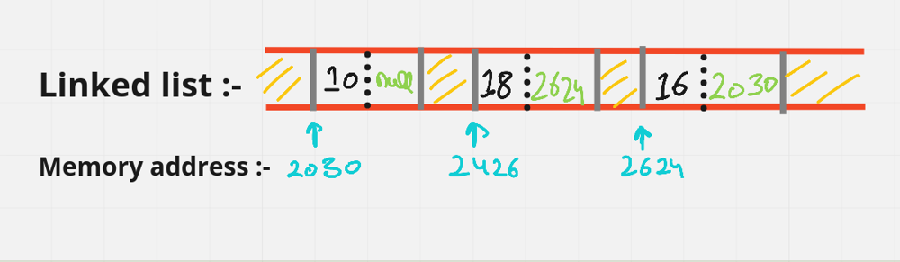
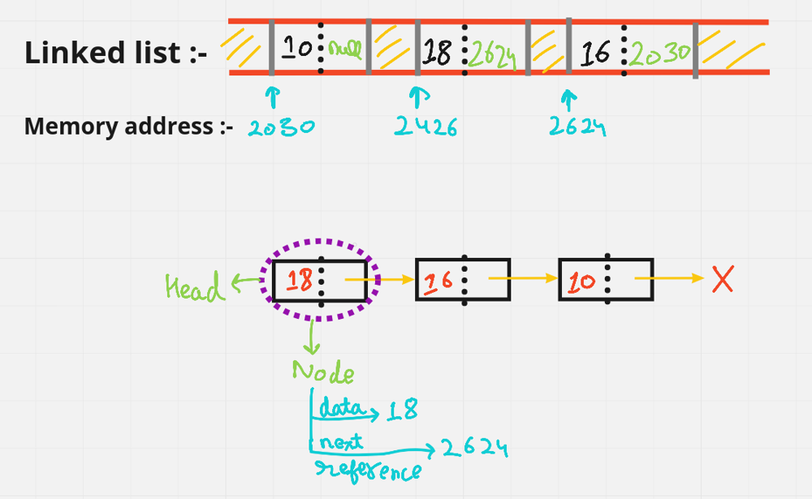
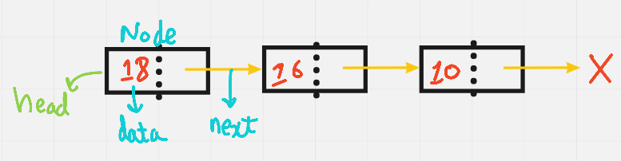
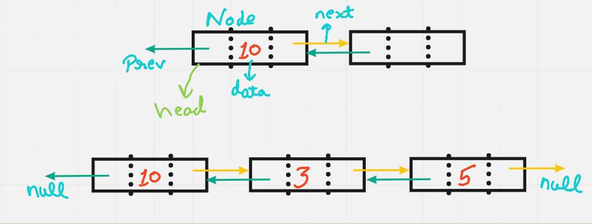
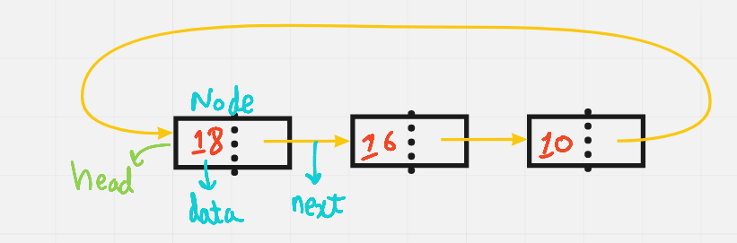

> <h1> LinkedList </h1>

<!DOCTYPE html>
<html lang="en">
<head>
    <meta charset="UTF-8">
    <meta http-equiv="X-UA-Compatible" content="IE=edge">
    <meta name="viewport" content="width=device-width, initial-scale=1.0"><title>Strings</title>
</head>
<body>

    Linked list is an linear data structure, which consists of a group of nodes in a sequence [OR] Linked list in which we store data in linear from!
<i>But, Array also stores data in linear form. Then what's the difference! </i>

In array, we have to first define the size of the Array
Let's say:-

    int arr[] = new int[8]
    Array :- [10, 20, 15, 18, 16, 10, 20, 16]

And each bit has its memory address, where 1 bit size = 4, therefore 8 bit = 8 * 4 = 32 bit.

But linked list is dynamic, we don't have to define it's size.

    In linked list we can add element as many as we want. But, in array size is fixed. So, to add new element we have to create a new array!

     Advantages                                              DisAdvantages

    1. Dynamic Nature                                   1. More memory usage due to address pointer
    2. Optimal insertion & deletion                     2. Slow traversal compared to arrays
    3. Stack's & queues can be easily implemented       3. No reverse traversal in singly linked list
    4. No memory wastage                                4. No random access

<b>Time Complexity:</b>

Access: O(n) 
Search: O(n) 
Insert: O(1) 
Remove: O(1) 

There are 4 type's of linked list, but in general we use 3 type's only:-

    Singly-linked list: linked list in which each node points to the next node and the last node points to null

    Doubly-linked list: linked list in which each node has two pointers, p and n, such that p points to the previous node and n points to the next node; the last node's n pointer points to null
    

    Circular-linked list: linked list in which each node points to the next node and the last node points back to the first node

</body>
</html>
