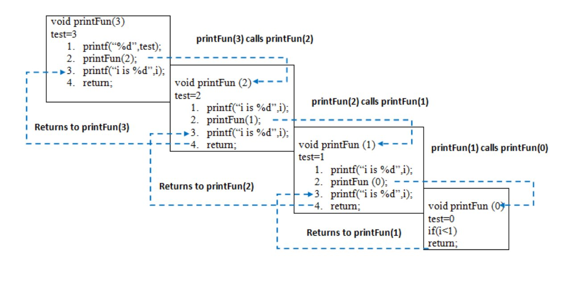

> <h1> Recursion </h1>

<!DOCTYPE html>
<html lang="en">
<head>
    <meta charset="UTF-8">
    <meta http-equiv="X-UA-Compatible" content="IE=edge">
    <meta name="viewport" content="width=device-width, initial-scale=1.0">
</head>
<body>

<h2> What is recursion </h2>

<b>Normal Function vs Recursive function: </b>

Normal function end after the operation but the recursion will call until the base case hasn't reached.

The process in which a function calls itself directly or indirectly is called recursion and the corresponding function
is called a recursive function.

<i> Two Things in recursive call </i>
 <ul>
    <li><strong>Hypothesis </strong> : The function which will be recursive for a condition. like Solve ( n ) -> 1-n </li>
    <li><strong>Induction:</strong> How we print the value . </li>
    <li><strong>Base Condition:</strong> Smallest valid input where the recursion will stop</li>
</ul>
    
    int fact(int n)
    {

    if (n < = 1) // base case
    return 1;
    else    
    return n * fact(n-1) ;    

    }

<b>Why Stack Overflow error occurs in recursion?</b>

If the base case is not reached or not defined, then the stack overflow problem may arise. Let us take an example to
understand this.

    int fact(int n)
    {
    // wrong base case (it may cause
    // stack overflow).
    if (n == 100)
    return 1;

    else
        return n*fact(n-1);
    }

<b>What is the difference between direct and indirect recursion?</b>
 
A function fun is called direct recursive if it calls the same function fun. A function fun is called indirect recursive
if it calls another function say fun_new and fun_new calls fun directly or indirectly. The difference between direct and
indirect recursion has been illustrated in Table 1.

    // An example of direct recursion
    void directRecFun()
    {
    // Some code....

    directRecFun();

    // Some code...
    }

    // An example of indirect recursion
    void indirectRecFun1()
    {
    // Some code...

    indirectRecFun2();

    // Some code...
    }
    void indirectRecFun2()
    {
    // Some code...

    indirectRecFun1();

    // Some code...
    }

<b>How memory is allocated to different function calls in recursion?</b>
 
When any function is called from main(), the memory is allocated to it on the <b>stack</b>. A recursive function calls
itself, the memory for a called function is allocated on top of memory allocated to the calling function and a different
copy of local variables is created for each function call. When the base case is reached, the function returns its value
to the function by whom it is called and memory is de-allocated and the process continues.
Let us take the example of how recursion works by taking a simple function.

    class GFG {
    static void printFun(int test)
    {
    if (test < 1)
    return;
    else {
    System.out.printf("%d ", test);
    printFun(test - 1); // statement 2
    System.out.printf("%d ", test);
    return;
    } }

	// Driver Code 
	public static void main(String[] args) 
	{ 
		int test = 3; 
		printFun(test); 
	}}

<b> Output</b>

    3 2 1 1 2 3 

Time Complexity: O(1)
 
Auxiliary Space: O(1)

When <strong>printFun(3)</strong> is called from main(), memory is allocated to <strong>printFun(3)</strong> and a local variable test is initialized to 3 and statement 1 to 4 are pushed on the stack as shown in below diagram. It first prints ‘3’. In statement 2, <strong>printFun(2)</strong> is called and memory is allocated to <strong>printFun(2)</strong> and a local variable test is initialized to 2 and statement 1 to 4 are pushed into the stack. Similarly, <strong>printFun(2)</strong> calls <strong>printFun(1)</strong> and <strong>printFun(1)</strong> calls <strong>printFun(0)</strong>. <strong>printFun(0)</strong> goes to if statement and it return to <strong>printFun(1)</strong>. The remaining statements of <strong>printFun(1) </strong>are executed and it returns to <strong>printFun(2)</strong> and so on. In the output, values from 3 to 1 are printed and then 1 to 3 are printed. The memory stack has been shown in below diagram.

</body>
</html>
