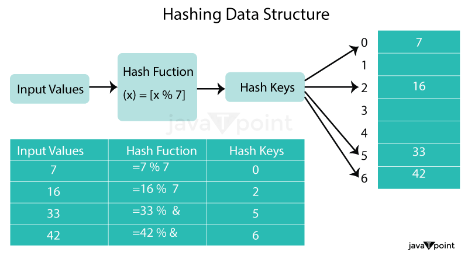
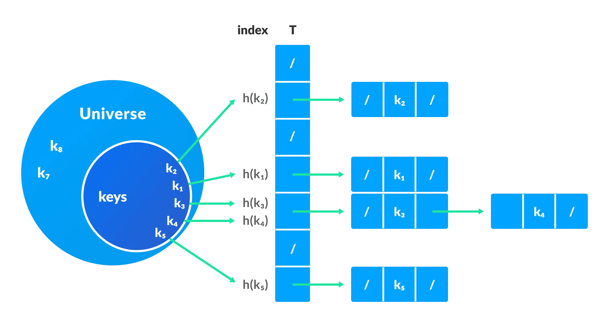

> <h1> Hash Map Basics </h1>

<!DOCTYPE html>
<html lang="en">
<head>
    <meta charset="UTF-8">
    <meta http-equiv="X-UA-Compatible" content="IE=edge">
    <meta name="viewport" content="width=device-width, initial-scale=1.0">
</head>
<body>
<h3>What is Hashing?</h3>

    A hashing algorithm is used to convert an input (such as a string or integer) into a fixed-size output (referred to as a hash code or hash value).

Hashing is commonly used to create a unique identifier for a piece of data, which can be used to quickly look up that data in a large dataset. For example, a web browser may use hashing to store website passwords securely. When a user enters their password, the browser converts it into a hash value and compares it to the stored hash value to authenticate the user.
 
<h3>What is a hash Key?</h3>
In the context of hashing, a hash key (also known as a hash value or hash code) is a fixed-size numerical or alphanumeric representation generated by a hashing algorithm. It is derived from the input data, such as a text string or a file, through a process known as hashing.

Hashing involves applying a specific mathematical function to the input data, which produces a unique hash key that is typically of fixed length, regardless of the size of the input. The resulting hash key is essentially a digital fingerprint of the original data.

The hash key serves several purposes. It is commonly used for data integrity checks, as even a small change in the input data will produce a significantly different hash key. Hash keys are also used for efficient data retrieval and storage in hash tables or data structures, as they allow quick look-up and comparison operations.

<h3>How Hashing Works?</h3>

The process of hashing can be broken down into three steps:
<ul>
    <li>Input: The data to be hashed is input into the hashing algorithm.</li>
    <li>Hash Function: The hashing algorithm takes the input data and applies a mathematical function to generate a fixed-size hash value. The hash function should be designed so that different input values produce different hash values, and small changes in the input produce large changes in the output.</li>
    <li>Output: The hash value is returned, which is used as an index to store or retrieve data in a data structure.</li>
</ul>

<h3>Hash Function:</h3>

A hash function is a type of mathematical operation that takes an input (or key) and outputs a fixed-size result known as a hash code or hash value. The hash function must always yield the same hash code for the same input in order to be deterministic. Additionally, the hash function should produce a unique hash code for each input, which is known as the hash property.

Division method:
This method involves dividing the key by the table size and taking the remainder as the hash value. For example, if the table size is 10 and the key is 23, the hash value would be 3 (23 % 10 = 3).

<h3>Collision Resolution</h3>

One of the main challenges in hashing is handling collisions, which occur when two or more input values produce the same hash value. There are various techniques used to resolve collisions, including:

<ul>
    <li>Chaining: In this technique, each hash table slot contains a linked list of all the values that have the same hash value. This technique is simple and easy to implement, but it can lead to poor performance when the linked lists become too long.</li>
    <li>Open addressing: In this technique, when a collision occurs, the algorithm searches for an empty slot in the hash table by probing successive slots until an empty slot is found. This technique can be more efficient than chaining when the load factor is low, but it can lead to clustering and poor performance when the load factor is high.</li>
    <li>Double hashing: This is a variation of open addressing that uses a second hash function to determine the next slot to probe when a collision occurs. This technique can help to reduce clustering and improve performance.</li>
</ul>

<h3>Example of Collision Resolution</h3>

Let's continue with our example of a hash table with a size of 5. We want to store the key-value pairs "John: 123456" and "Mary: 987654" in the hash table. Both keys produce the same hash code of 4, so a collision occurs.

We can use chaining to resolve the collision. We create a linked list at index 4 and add the key-value pairs to the list. The hash table now looks like this:

0:

1:

2:

3:

4: John: 123456 -> Mary: 987654

5:

  
<ul>
    <li><i>HashTable - </i> A data structure that stores unique keys to values ex. (Integer, String)</li>
    <t>Each Key/value pair is known as an Entry</t>
     
    <t><b>FAST</b>  Insertion, look up , deletation of key/value pairs.</t>
     
    Not Ideal for small data sets, great with large data sets.
</ul>

    Java HashMap is similar to HashTable, but it is unsynchronized. It allows to store the null keys as well, 
    but there should be only one null key object and there can be any number of null values.

<strong>Best Case:</strong> 

Access (get): O(1) 
Insertion (put): O(1) 
Deletion (remove): O(1) 

<strong>Average Case:</strong>

Access (get): O(1) 
Insertion (put): O(1) 
Deletion (remove): O(1) 

<strong>Worst Case: </strong>

Access (get): O(n) 
Insertion (put): O(n) 
Deletion (remove): O(n) 

</body>
</html>
